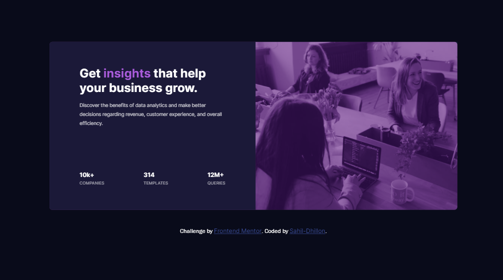
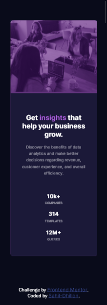

# Frontend Mentor - Stats preview card component solution

This is a solution to the [Stats preview card component challenge on Frontend Mentor](https://www.frontendmentor.io/challenges/stats-preview-card-component-8JqbgoU62). Frontend Mentor challenges help you improve your coding skills by building realistic projects. 

## Table of contents

- [Overview](#overview)
  - [The challenge](#the-challenge)
  - [Screenshot](#screenshot)
  - [Links](#links)
- [My process](#my-process)
  - [Built with](#built-with)
  - [What I learned](#what-i-learned)
  - [Continued development](#continued-development)
- [Author](#author)


## Overview

### The challenge

Users should be able to:

- View the optimal layout depending on their device's screen size
- Desktop Design


- Mobile Design


### Screenshot
- Desktop Screenshot



- Mobile Screenshot



### Links

- Solution URL: [https://github.com/Sahil-Dhillon/frontend-mentor-challenge-stats-card](https://github.com/Sahil-Dhillon/frontend-mentor-challenge-stats-card)
- Live Site URL: [https://sahil-dhillon.github.io/frontend-mentor-challenge-stats-card/](https://sahil-dhillon.github.io/frontend-mentor-challenge-stats-card/)

## My process

### Built with

- Semantic HTML5 markup
- CSS custom properties
- Flexbox

### What I learned

```css
.img {
  mix-blend-mode: soft-light;
}
```

### Continued development

- Responsive Images
- Image properties

## Author

- Frontend Mentor - [@Sahil-Dhillon](https://www.frontendmentor.io/profile/Sahil-Dhillon)
- Twitter - [@zsahildhillon](https://www.twitter.com/zsahildhillon)
- Instagram - [@zsahildhillon](https://www.instagram.com/zsahildhillon)
